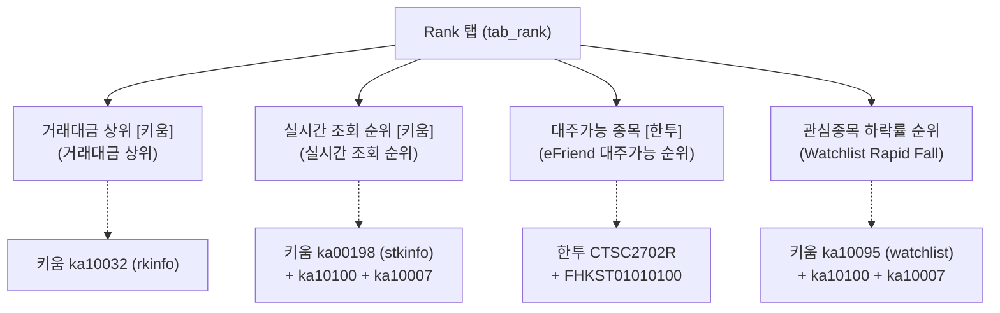
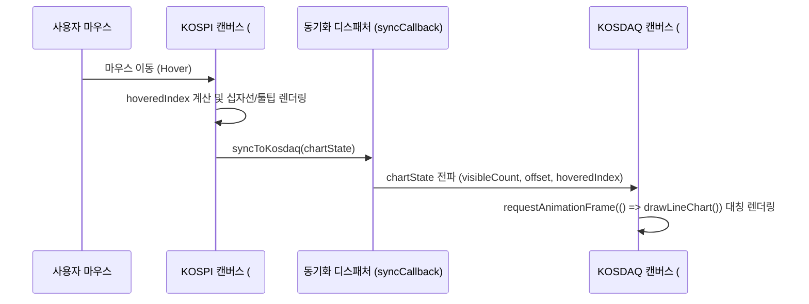
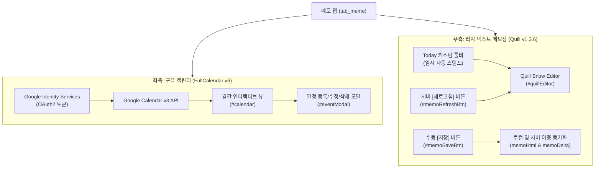
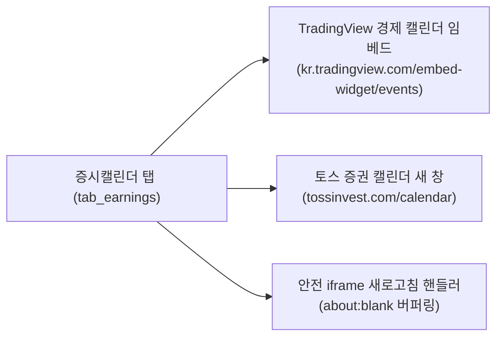

# 키움 실시간 랭킹 시스템 사양서 (System Specification)

> **문서 버전**: v1.0.0  
> **최초 작성일**: 2026-09-26  
> **최근 업데이트**: 2026-09-26  
> **대상 시스템**: 키움증권 실시간 종목 순위 및 종합 대시보드 웹서비스 (`kiwoom_realtimerank`)

---

## 📌 문서 개요 및 목적

본 사양서는 키움증권 REST API, 한국투자증권(eFriend) 오픈 API, 글로벌 금융 지표(TradingEconomics, FRED, ECOS 등)를 통합하여 제공하는 종합 금융 대시보드 시스템의 동작 및 기능 사양서입니다.  
향후 **AI-SDLC(Software Development Life Cycle)** 프로세스로 전환 및 마이그레이션 시 요구사항 정의, 아키텍처 재설계, 기능 검증의 단일 기준(Single Source of Truth)으로 사용됩니다.

---

## 📑 전체 시스템 구조 및 사양 목차

1. **고정 탭 (Permanent Tabs) 상세 사양**
   - 1.1 Rank 탭 (실시간 순위 / 거래대금 / 대주 / 관심종목 하락률) *(작성 완료)*
   - 1.2 ADR 탭 (KOSPI / KOSDAQ 등락비율 차트) *(작성 완료)*
   - 1.3 메모 탭 (Google Calendar 연동 & Rich Text Memo) *(작성 완료)*
   - 1.4 증시캘린더 탭 (실적 발표 및 글로벌 경제 캘린더) *(작성 완료)*
2. **동적/실시간 탭 (Dynamic Tabs) 통합 상세 사양** *(작성 완료)*
   - 2.1 종류 및 탭 생명주기
   - 2.2 기본 차트 그리드 조작
   - 2.3 사용자 정의 해외/환율·금리 차트 설정 및 문법
   - 2.4 데이터 로드, 갱신 및 상호작용
   - 2.5 제약 사항 및 예외 처리
3. **설정 관리 및 동기화 (Settings & Persistence) 상세 사양** *(작성 완료)*
   - 3.1 로컬 스토리지(`localStorage`) 및 서버 파일(`user_settings.json`) 저장 메커니즘
   - 3.2 다중 클라이언트/브라우저 동기화 및 충돌 방지 정책
   - 3.3 일괄 내보내기/가져오기 (Bulk Export/Import) 사양

---

# 1. 고정 탭 (Permanent Tabs) 상세 사양

고정 탭은 애플리케이션 시작 시 상시 로드되는 핵심 시스템 탭입니다. 고정 ID와 기능은 삭제할 수 없고 탭 순서도 사용자가 변경할 수 없습니다. 탭 이름 편집 UI는 공통으로 동작하지만 이름 저장 규칙은 탭별로 다릅니다.

### 1.0.1 탭 이름 편집 및 저장 정책

* 탭 버튼을 더블클릭하면 이름 편집 입력란으로 바뀐다. 입력 후 `Enter` 또는 포커스 이탈(blur)로 편집을 마친다. 이름이 빈 문자열이면 편집 전 이름을 유지한다.
* 편집 완료 시 탭 이름을 현재 화면과 설정 스냅샷에 반영하고 `saveAppData()`를 호출한다.
* `Rank`, `ADR`, `증시캘린더`는 저장/복원 시 시스템 기본 이름으로 정규화된다. 현재 화면에서는 편집 직후 입력한 문구가 보일 수 있으나, 설정에는 기본 이름이 저장되고 다음 실행 시 기본 이름으로 표시된다.
* `메모`는 고정 기능 탭이지만 사용자 지정 이름을 허용한다. 편집한 이름은 설정에 저장되어 다음 실행에도 유지된다.
* 동적 탭 이름은 탭 ID와 별도로 설정의 `tabs[].name`에 저장되며, 사용자 변경 이름을 다음 실행에 복원한다.
* 따라서 탭 이름 변경이 영구 반영되는지는 탭 종류에 따라 다르다. 현재 영구 사용자 지정 이름을 지원하는 고정 탭은 메모이며, 동적 탭은 모두 사용자 지정 이름을 유지한다.



---

## 1.1 Rank 탭 (`tab_rank`)

### 1.1.1 개요
* **탭 식별자**: `tab_rank` (`PERM_TAB_ID`)
* **탭 명칭**: `Rank` (고정)
* **목적**: 국내 주식 시장(KOSPI, KOSDAQ)의 실시간 자금 유입(거래대금), 시장 참여자들의 실시간 관심도(조회순위), 공매도/대주 가능 수량 및 잔고, 개인 관심종목 그룹 내 급락주 현황을 4개 패널로 한눈에 모니터링.

---

### 1.1.2 화면 레이아웃 및 UI 구성 요소

| 영역 | 컴포넌트 ID / 클래스 | 유형 | 기능 설명 |
| :--- | :--- | :--- | :--- |
| **상단 헤더** | `#tab_rank header` | Container | Rank 탭 제목, 자동 새로고침 주기 설정, 수동 조회 버튼, 상태 표시줄 포함 |
| **새로고침 주기** | `#refreshInterval` | `<select>` | 자동 데이터 갱신 간격 선택 (30초, 1분, 10분, 1시간, 당일누적) |
| **수동 조회** | `#manualRefresh` | `<button>` | 4개 패널 데이터 즉시 동시 갱신 트리거 |
| **최근 갱신 시간** | `#lastUpdate` | `<span>` | 마지막으로 성공한 데이터 수신 시간 표시 (`HH:MM:SS`) |
| **상태 메시지** | `#statusText` | `<span>` | 대기 중 / 데이터 로딩 중... / 데이터 로딩 완료 / 데이터 로딩 실패 |
| **에러 패널** | `#errorMessage`, `#errorText` | `<div>` | 통신 실패 시 에러 사유를 붉은색 경고 박스로 표출 |
| **패널 1** | `#transactionTable` | `<table>` | 전일 동시간 대비 거래대금 상위 종목 목록 |
| **패널 2** | `#stockTable` | `<table>` | 키움 실시간 종목 조회 순위 상위 목록 |
| **패널 3** | `#efriendStockTable` | `<table>` | 한국투자증권 eFriend 대주가능 종목 목록 (등락률순) |
| **패널 4** | `#watchlistTable` | `<table>` | 관심종목 그룹 내 하락률 상위 종목 목록 |

---

### 1.1.3 세부 패널 기능 사양

#### [패널 1] 거래대금 상위 [키움]
* **연동 백엔드 API**: `GET /api/transaction_rank`
* **요청 쿼리 파라미터**:
  - `mrkt_tp`: 시장 구분 (`000`: 전체, `001`: 코스피, `101`: 코스닥)
  - `stex_tp`: 거래소 구분 (`1`: KRX, `2`: NXT, `3`: 통합) — 기본값: `3` (통합)
* **연동 원천 API**: 키움증권 `ka10032` (전일동시간대비거래대금상위요청)
  - 엔드포인트: `POST https://api.kiwoom.com/api/dostk/rkinfo`
  - 고정 파라미터: `mang_stk_incls: "0"` (관리종목 제외)
* **표시 컬럼 및 포맷팅**:
  1. **순위 (`rank`)**: 정수 순위 표기
  2. **시장 (`market-type`)**: `mkt_type` 기반 (K: KOSPI, Q: KOSDAQ, ETF 등 뱃지)
  3. **종목명 (`stk_nm` / `isu_nm`)**: 텍스트
  4. **등락률 (`fluc_rt`)**: 부호(`+`, `-`) 포함 소수점 2자리 표기 (양수: 빨강 `price-up`, 음수: 파랑 `price-down`, 0: 회색)
  5. **거래대금 (`trde_amt` / `acml_tr_pbmn`)**: 단위 백만원. 원 단위 수치인 경우 `Math.round(num / 1,000,000)`로 절사 포맷팅.
* **출력 제한**: 상위 20개 항목 (`slice(0, 20)`)

#### [패널 2] 실시간 조회 순위 [키움]
* **연동 백엔드 API**: `GET /api/data?qry_tp={qry_tp}`
* **요청 쿼리 파라미터**: `qry_tp` (1: 30초, 2: 1분, 3: 10분, 4: 1시간, 5: 당일누적)
* **연동 원천 API 파이프라인**:
  1. `ka00198` (실시간종목조회순위): `POST https://api.kiwoom.com/api/dostk/stkinfo`
  2. `ka10100` (주식기본정보): 시장코드(`marketCode`) 확인 (`0`: KOSPI, `10`: KOSDAQ만 통과, ETF/ETN 필터링)
  3. `ka10007` (시세표성정보): 당일 누적 거래대금(`trde_prica`, 백만 단위) 보강
* **표시 컬럼 및 포맷팅**:
  1. **순위 (`bigd_rank`)**: 1~20위
  2. **시장 (`mkt_type`)**: K / Q
  3. **종목명 (`stk_nm`)**: ETF(KODEX, TIGER 등) 및 관리종목 배제된 순수 주식명
  4. **등락률 (`base_comp_chgr`)**: 등락 색상 클래스 적용
  5. **거래대금 (`trde_amt`)**: 백만원 단위 표시
* **출력 제한**: 상위 20개 항목

#### [패널 3] 대주가능 종목 [한투]
* **연동 백엔드 API**: `GET /api/data` 응답 객체의 `data.efriend`
* **연동 원천 API 파이프라인**:
  1. 한국투자증권 토큰 발급 (`/oauth2/tokenP`)
  2. 대주가능 종목 페이징 조회 (`CTSC2702R`, `/uapi/domestic-stock/v1/quotations/lendable-by-company`, 최대 50페이지 순회)
  3. 현재가/등락률 조회 (`FHKST01010100`, `/uapi/domestic-stock/v1/quotations/inquire-price`)
* **정렬 로직**: 수신된 전체 종목 중 당일 등락률(`prdy_ctrt`) 기준 내림차순(상승률 높은 순) 정렬
* **표시 컬럼 및 포맷팅**:
  1. **순위**: 1부터 순차 인덱스
  2. **시장**: `rprs_mrkt_kor_name` 분석 후 K / Q 표기
  3. **종목명 (`prdt_name`)**: 종목명
  4. **등락률 (`prdy_ctrt`)**: 등락 색상 적용
  5. **매매가능수량 (`trad_psbl_qty2`)**: 0 초과 시 `price-up` 하이라이트
  6. **매매가능금액 (계산 컬럼)**: `현재가(stck_prpr) × 매매가능수량(trad_psbl_qty2)` (단위: 원, 천 단위 쉼표 표기)

#### [패널 4] 관심종목 하락률 순위 (Watchlist Rapid Fall)
* **연동 백엔드 API**:
  - 그룹 목록: `GET /api/watchlist_groups`
  - 랭킹 데이터: `GET /api/watchlist_rank?grp_id={grp_id}`
* **연동 원천 API 파이프라인**:
  - 키움증권 `ka10095` (관심종목조회): `POST https://api.kiwoom.com/api/dostk/watchlist`
  - 종목별 `ka10100`(시장구분) 및 `ka10007`(상세거래대금) 보강
* **컨트롤 인터랙션**:
  - 그룹 선택 드롭다운(`watchlistGroupSelect`): 서버에서 조회된 사용자 관심종목 그룹 목록 표시
  - 그룹 직접 입력창(`watchlistGroupNameInput`): 임의 그룹 ID(기본값: `074`) 직접 입력 시 즉시 해당 그룹 조회
  - 선택/입력값 변경 시 `localStorage.setItem('watchlist_selected_group', val)`에 영구 저장 및 설정 동기화
* **정렬 로직**: **하락률이 큰 순서(가장 큰 마이너스 등락률부터 오름차순 정렬)**
* **표시 컬럼**: 순위(1~20), 시장(K/Q), 종목명, 등락률(파란색 하락 강조), 거래대금(백만)

---

### 1.1.4 자동 갱신 및 타이머 스케줄링 사양

1. **초기 로드 (`DOMContentLoaded`)**:
   - `loadData()` (패널 2 & 패널 3)
   - `loadTransactionRank()` (패널 1)
   - `loadWatchlistGroups()` & `loadWatchlistRank()` (패널 4)
   - `startAutoRefresh()` 호출로 주기적 타이머 가동
2. **타이머 동작 방식**:
   - `setInterval`을 이용해 선택된 주기(`refreshInterval`의 `data-interval` 밀리초)마다 3개 로더 병렬 실행
   - 화면 캡처 모드(`isCapturing === true`) 시에는 네트워크 부하 및 화면 깜빡임 방지를 위해 모든 자동 갱신 스킵
3. **백그라운드 탭 갱신 최적화**:
   - 사용자가 Rank 탭이 아닌 다른 탭을 보고 있을 때 자동 갱신이 발생하면, 오류 팝업/경고창을 띄우지 않고 콘솔 경고(`console.warn`)로만 기록하여 UX 간섭 차단.

---

### 1.1.5 제약 사항 및 예외 처리 (Constraints & Fallbacks)

1. **키움 API 호출 빈도 제한 (HTTP 429 Too Many Requests 방지)**:
   - 키움증권 REST API는 초당 요청 제한(초당 5회 내외)이 엄격함.
   - 종목별 상세 시세 조회 시 `chunkSize = 1` 단위로 처리하며, 루프 간 `100ms`의 인위적 `setTimeout` 딜레이 적용.
2. **Access Token 캐싱 및 만료 자동 복구**:
   - 키움 및 한투 토큰은 24시간 유효하며, 서버 메모리 변수(`cachedToken`, `tokenExpiryTime`)에 보관.
   - 원천 API 호출 결과 `return_code === 3` 또는 `"Token이 유효하지 않습니다"` 수신 시 토큰 캐시를 즉시 강제 무효화(`cachedToken = null`)하고 다음 요청 시 재발급.
3. **환경 변수 누락 처리**:
   - `.env`에 키움 키(`KIWOOM_APPKEY`, `KIWOOM_SECRETKEY`) 누락 시 HTTP 500 반환.
   - 한투 키(`EFRIEND_APPKEY` 등) 누락 시 서버 크래시 없이 패널 3(eFriend)만 안전하게 빈 배열(`[]`)로 반환.
4. **장 운영 시간 외 처리 (야간 / 주말 / 공휴일)**:
   - 장 시작 전/종료 후에는 전일 마감 종가 및 최종 누적 거래대금이 반환되며, 시스템은 실시간 갱신 실패로 취급하지 않고 정상 렌더링 유지.

---

## 1.2 ADR 탭 (`tab_adr`)

### 1.2.1 개요
* **탭 식별자**: `tab_adr` (`ADR_TAB_ID`)
* **탭 명칭**: `ADR` (고정)
* **목적**: 국내 주식시장(KOSPI, KOSDAQ)의 시장 과열 및 침체 여부를 판단하는 대표적 심리/수급 지표인 **등락비율(ADR, Advance Decline Ratio)**의 과거 시계열 추세를 HTML5 Canvas 듀얼 차트로 시각화.
  $$\text{ADR} = \frac{\text{20일간 상승 종목 수의 합계}}{\text{20일간 하락 종목 수의 합계}} \times 100 (\%)$$

```mermaid
flowchart LR
    Source["adrinfo.kr/chart"] -->|HTML 스크랩| BackendProxy["Express 프록시 (/api/adr)"]
    BackendProxy -->|Raw HTML| ClientParser["클라이언트 괄호 파서<br/>(extractArrayFromHtml)"]
    ClientParser -->|{kospi: [], kosdaq: []}| StateStore["tabData[tab_adr].adr"]
    StateStore --> DualCanvas["듀얼 캔버스 동기화 렌더러<br/>(#adr_kospi, #adr_kosdaq)"]
```

---

### 1.2.2 화면 레이아웃 및 UI 구성 요소

| 영역 | 컴포넌트 ID / 클래스 | 유형 | 기능 설명 |
| :--- | :--- | :--- | :--- |
| **상단 헤더** | `#tab_adr header` | Container | ADR 탭 제목, 자동 새로고침 주기 선택, 수동 조회 버튼, 상태 표시줄 |
| **새로고침 주기** | `#adrRefreshInterval` | `<select>` | 자동 조회 간격 (30초, 1분, 10분[기본], 1시간, 당일누적) |
| **수동 조회** | `#adrManualRefresh` | `<button>` | ADR 데이터 원천 프록시 재호출 트리거 |
| **상태 표시** | `#adrLastUpdate`, `#adrStatusText` | `<span>` | 최근 갱신 시각 및 처리 상태(데이터 로딩 중... / 업데이트 완료 / 업데이트 실패) |
| **차트 컨테이너** | `.adr-chart-container` | Flex Container | KOSPI와 KOSDAQ 2개 차트 래퍼를 수용하는 반응형 스크롤 컨테이너 |
| **KOSPI 차트** | `#adr_kospi` | `<canvas>` | KOSPI 시장의 20일 ADR 시계열 라인 차트 |
| **KOSDAQ 차트** | `#adr_kosdaq` | `<canvas>` | KOSDAQ 시장의 20일 ADR 시계열 라인 차트 |
| **기간 선택기** | `.period-btn` | `<button>` 그룹 | 6m (120일), 1y (240일), 2y (480일[기본]), 5y (1200일), 10y (2400일) |

---

### 1.2.3 데이터 수집 및 파싱 파이프라인

1. **백엔드 프록시 엔드포인트 (`GET /api/adr`)**:
   - 브라우저의 CORS(Cross-Origin Resource Sharing) 제한을 우회하기 위해 Node.js 백엔드 프록시 사용.
   - 요청 대상: `http://adrinfo.kr/chart?t=${timestamp}`
   - 요청 헤더: Chrome 데스크톱 표준 `User-Agent` 모방 전송.
   - 타임아웃: 8,000ms.
   - 응답: 원천 사이트의 원본 HTML 문자열 반환 (`res.send(response.data)`).
2. **클라이언트 괄호 밸런싱 파서 (`extractArrayFromHtml`)**:
   - 원천 HTML 내에 인라인 선언된 자바스크립트 전역 배열 추출:
     - `kospi_adr = [[timestamp, value], ...]`
     - `kosdaq_adr = [[timestamp, value], ...]`
   - **안정성 보장 알고리즘**:
     - 정규식 파싱 시 발생할 수 있는 긴 문자열 메모리 폭주(ReDoS)를 방지하기 위해 **대괄호 균형 스택(Bracket Balance Counter)** 알고리즘 적용 (`[` 만나면 balance++, `]` 만나면 balance--).
     - balance가 0이 되는 지점을 엄격히 찾아 유효한 JSON 배열 문자열을 절삭.
     - `JSON.parse` 실행 (말미 쉼표 `, ]` 자동 정규화).
     - 만약 JSON 파싱 실패 시 정규식 폴백(`\[\s*(\d+)\s*,\s*([-]?\d*\.?\d+)\s*\]`) 2차 안전망 가동.
   - 정렬 및 정제:
     - `null` 데이터 포인트 필터링.
     - 날짜 타임스탬프(`date`) 기준 오름차순(과거 → 현재) 정렬.
     - 결과 객체 `{ kospi: [{date, value}], kosdaq: [{date, value}] }`를 `tabData['tab_adr'].adr`에 캐싱.

---

### 1.2.4 듀얼 차트 동기화 인터랙션 (Dual Chart Synchronization)

두 시장의 지표를 직관적으로 비교하고 분석하기 위해 **강력한 듀얼 인터랙션 동기화 엔진**을 내장합니다.



1. **Y축 스케일 공유 (`getCombinedRange`)**:
   - 두 시장의 등락비율 강도를 직접 비교할 수 있도록, 현재 표시 중인 구간의 KOSPI 수치와 KOSDAQ 수치를 합쳐 전체 최소값(`minVal`)과 최대값(`maxVal`)을 산출하여 두 차트의 Y축 눈금을 동일하게 동기화.
2. **커서 및 십자선 동기화 (`syncToKosdaq` / `syncToKospi`)**:
   - 한 캔버스에서 마우스가 위치한 데이터 인덱스(`hoveredIndex`)를 감지하면, 반대편 캔버스에도 동일 일자의 수직 십자선(Crosshair) 및 툴팁 박스가 `requestAnimationFrame`을 통해 딜레이 없이 실시간 동기 렌더링.
3. **패닝 및 스크롤바 동기화**:
   - 차트 내부를 마우스로 드래그(Panning)하거나 하단 미니 스크롤바를 조작할 때, 두 차트의 `scrollOffset`과 `visibleCount`가 1:1로 일치되어 이동.
4. **마우스 휠 줌(Zoom) & 이동**:
   - 캔버스 영역 내에서 휠 조작 시 표시 데이터 개수 및 오프셋 조정.

---

### 1.2.5 차트 렌더링 세부 사양 (`drawLineChart`)

* **고해상도 디스플레이(HiDPI/Retina) 지원**:
  - `window.devicePixelRatio`를 측정하여 캔버스의 실제 픽셀 버퍼 크기를 스케일업(`canvas.width = w * dpr`) 후 `ctx.setTransform(dpr, 0, 0, dpr, 0, 0)` 적용. 번짐 없는 선명한 벡터 렌더링 보장.
* **영역 및 기준선 가이드**:
  - **정상 구간 (Normal Zone, 80 ~ 120)**:
    - Y축 80에서 120 사이 영역을 반투명 회색 배경(`rgba(200, 200, 200, 0.2)`)으로 채움.
  - **침체/과매도 기준선 (80%)**: 주황색 점선 (`#ffa94d`), 두께 1px, 대시 `[5, 5]`. 수치 80 표기.
  - **중립/균형 기준선 (100%)**: 빨간색 점선 (`#ff6b6b`), 두께 1px. 수치 100 표기.
  - **과열/과매수 기준선 (120%)**: 녹색 점선 (`#51cf66`), 두께 1px. 수치 120 표기.
* **시계열 데이터 라인**:
  - 선 색상: `#339af0`, 두께: 2px, 조인: `round`.
  - 최신 데이터 포인트(당일): 반지름 4px의 붉은색 원점(`#ff0000`, 흰색 테두리)으로 하이라이트.
* **X축 눈금 (일자 표시)**:
  - 현재 가시 구간을 6등분하여 수직 그리드 라인(`#e9ecef`) 및 `YY.MM` 포맷 일자 출력.
* **툴팁 박스 (Tooltip)**:
  - 호버 위치에 날짜(`YYYY-MM-DD`), 시장 구분, ADR 수치(소수점 1자리)를 다크 반투명 박스에 표출.

---

### 1.2.6 기간 선택기 (Period Selector)

차트 우측 상단의 기간 버튼을 클릭하면 표시되는 거래일 수가 즉시 전환되며, 항상 최신 데이터가 화면 우측 끝에 오도록 스크롤 오프셋을 자동 재정렬합니다.

| 버튼 레이블 | 표시 거래일 수 (`days`) | 실제 환산 기간 |
| :---: | :---: | :--- |
| `6m` | 120일 | 약 6개월 |
| `1y` | 240일 | 약 1년 |
| **`2y` (기본값)** | **480일** | **약 2년** |
| `5y` | 1200일 | 약 5년 |
| `10y` | 2400일 | 약 10년 (전체 추세) |

---

### 1.2.7 제약 사항 및 예외 처리 (Constraints & Fallbacks)

1. **원천 사이트(adrinfo.kr) 응답 구조 변경 방어**:
   - 응답 텍스트 길이가 100자 미만이거나 파싱 결과 배열 길이가 0인 경우, 차트 영역을 비우지 않고 이전 렌더링 상태를 보존하며 에러 상태 텍스트("업데이트 실패")를 표출.
2. **KOSPI와 KOSDAQ 데이터 길이 불일치 대응**:
   - 휴장일이나 거래소 시스템 점검 등으로 두 시장의 데이터 개수가 다를 경우(`kLen !== qLen`), 경고 로그(`console.warn`)를 남기고 각자의 길이에 맞춰 안전하게 클램핑(`Math.min`).
3. **불필요한 서버 설정 덮어쓰기 금지**:
   - 시세 지표 갱신 시 `saveAppData()`를 절대 호출하지 않음 (순수 시세 조회 동작과 영구 사용자 설정 저장을 엄격히 분리).
4. **백그라운드 탭 렌더링 부하 최소화**:
   - ADR 탭이 비활성화된 상태에서 타이머가 돌 때는 캔버스 재렌더링을 지연시키고, 탭이 활성화되는 순간(`activateTab('tab_adr')`) 단 1회 전체 렌더링 수행.

---

## 1.3 메모 탭 (`tab_memo`)

### 1.3.1 개요
* **탭 식별자**: `tab_memo` (`MEMO_TAB_ID`)
* **탭 명칭**: 기본값 `일정` 또는 사용자 지정 명칭 (탭 제목 더블클릭 변경 허용)
* **목적**: 트레이딩 및 투자 전략 수립에 필수적인 **개인 일정 관리(Google Calendar)**와 **서식 있는 투자 노트(Quill Rich Text Editor)**를 2분할 통합 작업 공간으로 제공.



---

### 1.3.2 화면 레이아웃 및 UI 구성 요소

| 영역 | 컴포넌트 ID / 클래스 | 유형 | 기능 설명 |
| :--- | :--- | :--- | :--- |
| **캘린더 헤더** | `.calendar-section .panel-header` | Header | '📅 구글 캘린더' 타이틀, [동기화] 버튼, [전체 화면] 버튼 |
| **동기화 버튼** | `#syncCalBtn` | `<button>` | Google OAuth2 인증 및 캘린더 이벤트 강제 재조회 |
| **전체화면 버튼** | `onclick="window.open(...)"` | `<button>` | Google Calendar 공식 웹서비스 새 탭 열기 |
| **캘린더 컨테이너**| `#calendar` | `<div>` | FullCalendar 월간 그리드 렌더링 컨테이너 (높이: 700px) |
| **메모 헤더** | `.memo-section .panel-header` | Header | '메모' 타이틀, 상태 메시지(`#memoStatus`), [새로고침] 버튼, [저장] 버튼 |
| **메모 상태 표시** | `#memoStatus` | `<span>` | 저장 완료, 서버 동기화 중, 새로고침 완료/실패 피드백 (2~3초 후 자동 소멸) |
| **메모 새로고침** | `#memoRefreshBtn` | `<button>` | 서버(`GET /api/settings`)에 저장된 최신 메모를 즉시 불러와 덮어씀 |
| **메모 수동 저장** | `#memoSaveBtn` | `<button>` | 작성 중인 메모(HTML 및 Delta)를 브라우저 로컬 및 서버에 즉시 영구 저장 |
| **리치 텍스트 에디터**| `#quillEditor` | `<div>` | Quill 에디터 본문 영역 (높이: 650px, 스크롤 가능) |
| **일정 팝업 모달** | `#eventModal` | Modal | 캘린더 날짜/일정 클릭 시 오픈되는 등록/수정/삭제 폼 대화상자 |

---

### 1.3.3 구글 캘린더 (Google Calendar) 연동 사양

1. **사용 라이브러리 및 뷰 구성**:
   - `FullCalendar` v6.1.10
   - 기본 뷰: 월간 그리드 뷰 (`dayGridMonth`), 시작 요일: 월요일 (`firstDay: 1`), 한국어 로케일 (`locale: 'ko'`)
   - 시간 표기: 24시간 표기법 (`HH:mm`, `hour12: false`)
2. **구글 인증(GIS, Google Identity Services)**:
   - 클라이언트 기반 OAuth2 Implicit Flow: `google.accounts.oauth2.initTokenClient`
   - 스코프(Scope): `https://www.googleapis.com/auth/calendar.events`
   - 브라우저 팝업 차단 방지 최적화: 앱 초기 구동 시 무조건 로그인 창을 띄우지 않고, 사용자가 [동기화]를 누르거나 캘린더 클릭 시에만 토큰 발급/갱신 수행.
3. **이벤트 수집 파이프라인 (`fetchCalendarEvents`)**:
   - 조회 범위: FullCalendar가 전달하는 현재 뷰의 시작일(`start`)부터 종료일(`end`)까지.
   - 2개 캘린더 병렬 조회 (`Promise.all`):
     1. **사용자 기본 캘린더**: `https://www.googleapis.com/calendar/v3/calendars/primary/events`
     2. **대한민국 공휴일 캘린더**: `ko.south_korea#holiday@group.v.calendar.google.com`
   - 공휴일 이벤트 스타일링:
     - 붉은색 파스텔톤 배경(`#fee2e2`), 붉은 테두리(`#ef4444`), 붉은 텍스트(`#b91c1c`).
     - 타이틀 앞 접두사 `🚩` 표기 및 편집/삭제 권한 비활성화.
4. **일정 등록 / 수정 / 삭제 모달 워크플로우**:
   - 빈 날짜 클릭(`dateClick`): 시작일자 자동 세팅된 등록 모드로 모달 오픈.
   - 기존 일정 클릭(`eventClick`): 제목, 시작/종료일시, 종일 여부, 설명 등이 로드된 수정 모드로 모달 오픈 (공휴일은 읽기 전용).
   - 저장 실행 (`saveGoogleEvent`):
     - 신규: `POST https://www.googleapis.com/calendar/v3/calendars/primary/events`
     - 수정: `PUT https://www.googleapis.com/calendar/v3/calendars/primary/events/{eventId}`
   - 삭제 실행 (`deleteGoogleEvent`):
     - `DELETE https://www.googleapis.com/calendar/v3/calendars/primary/events/{eventId}` (확인 대화상자 노출 후 수행)
   - 성공 시 `calendar.refetchEvents()` 호출로 화면 즉시 갱신.

---

### 1.3.4 리치 텍스트 메모장 (Quill Editor) 사양

1. **사용 라이브러리 및 툴바 모듈**:
   - `Quill` v1.3.6 (`snow` 테마)
   - 툴바 구성:
     - 헤더 서식: H1, H2, H3, 본문
     - 인라인 서식: Bold, Italic, Underline, Strike
     - 목록: 번호 매기기(Ordered), 불릿(Bullet)
     - 색상: 글자색(Color), 배경색(Background) 팔레트
     - 블록 서식: 인용구(Blockquote), 코드 블록(Code-block)
     - 미디어: 링크(Link), 이미지(Image)
     - 특수 기능: 서식 지우기(Clean), **[Today] 커스텀 버튼**
2. **[Today] 커스텀 버튼 사양**:
   - 동작: 사용자가 툴바의 'Today' 버튼을 클릭하면 현재 시각(`YYYY-MM-DD HH:mm`) 문자열을 커서가 위치한 곳에 굵은 글씨로 즉시 삽입.
   - 목적: 트레이딩 일지 작성 시 날짜/시간 스탬프 입력 편의성 극대화.
3. **이중 저장 포맷 및 동기화 (Double Storage)**:
   - 서식 정보 및 렌더링 안정성을 위해 두 가지 형태로 동시 저장:
     1. `memoHtml`: 브라우저 및 검색 엔진 호환용 Raw HTML 문자열 (`quillEditor.root.innerHTML`)
     2. `memoDelta`: 서식 위치와 구조를 100% 무손실 복원하는 Quill JSON Delta 객체 (`quillEditor.getContents()`)
4. **저장 및 새로고침 정책**:
   - **수동 저장 정책**: 타이핑할 때마다 발생하는 자동 저장은 키 입력 렉(Lag)과 다중 PC 간의 레이스 컨디션을 유발하므로 배제하고, 우측 상단 **[저장] (`#memoSaveBtn`) 버튼을 명시적으로 클릭할 때만 서버(`POST /api/settings`)로 전송**.
   - **서버 새로고침 기능 (`#memoRefreshBtn`)**: 다른 PC에서 작성된 최신 메모가 있을 경우, 브라우저 전체를 새로고침(F5)하지 않고도 메모 에디터만 서버 최신 데이터로 즉시 동기화.

---

### 1.3.5 제약 사항 및 예외 처리 (Constraints & Fallbacks)

1. **Quill 에디터 숨김 탭 내 초기화 이슈 방어**:
   - 브라우저 특성상 `display: none` 상태인 탭에서 Quill이나 FullCalendar가 초기화되면 크기 계산(높이 0) 에러가 발생함.
   - 따라서 탭이 처음 활성화(`activateTab('tab_memo')`)되는 순간 안전하게 초기화하며, 이미 초기화된 경우 `calendar.updateSize()`를 호출하여 레이아웃 깨짐을 방지.
2. **Google OAuth 토큰 만료(401 Unauthorized) 대응**:
   - API 요청 시 401 오류 발생 시 `accessToken = null`로 초기화하고 자동으로 재인증 프로세스 트리거.
3. **네트워크 단절 시 로컬 보존**:
   - 서버 통신이 실패하더라도 브라우저 `localStorage`(`memoContent_html`, `memoContent_delta`)에 최우선 보존되어 작성 내용 유실을 원천 차단.

---

## 1.4 증시캘린더 탭 (`tab_earnings`)

### 1.4.1 개요
* **탭 식별자**: `tab_earnings` (`EARNINGS_TAB_ID`)
* **탭 명칭**: `증시캘린더` (고정)
* **목적**: 국내(KR) 및 미국(US) 주요 기업의 실적 발표(Earnings), 통화정책 회의(FOMC/금통위), 고용/물가 지표(CPI, NFP 등) 글로벌 주요 증시 이벤트를 실시간 인터랙티브 위젯과 원클릭 외부 전문 서비스 연동으로 모니터링.



---

### 1.4.2 화면 레이아웃 및 UI 구성 요소

| 영역 | 컴포넌트 ID / 클래스 | 유형 | 기능 설명 |
| :--- | :--- | :--- | :--- |
| **상단 헤더** | `#tab_earnings header` | Header | '증시캘린더' 타이틀, [토스 캘린더 ↗] 링크 버튼, [새로고침] 버튼, 상태 표시줄 |
| **토스 캘린더 링크**| `button[onclick]` | `<button>` | `https://www.tossinvest.com/calendar`를 새 창(`_blank`)으로 열기 |
| **새로고침 버튼** | `#refreshEarnings_tab_earnings` | `<button>` | 임베디드 토스 캘린더 프록시 iframe을 깜빡임 없이 안전하게 리로드 |
| **상태 표시줄** | `#earningsLastUpdate_*`, `#earningsStatusText_*` | `<span>` | 최근 갱신 시각 및 처리 상태 표기 |
| **위젯 컨테이너** | `.overseas-content-scroll` | Div | 반응형 전체 높이 100% 스크롤 래퍼 (`.full-tab`) |
| **토스 캘린더 iframe**| `#iframeEarnings_tab_earnings` | `<iframe>` | `/api/toss_calendar`를 통해 토스증권 캘린더 페이지 표시 |

---

### 1.4.3 임베디드 위젯 및 연동 사양

1. **토스 캘린더 프록시**:
   - iframe은 같은 출처의 `/api/toss_calendar`를 요청한다.
   - Express 서버가 `https://www.tossinvest.com/calendar`를 User-Agent 및 한국어 Accept-Language 헤더와 함께 10초 제한으로 가져와 HTML로 반환한다.
   - 프록시는 `<head>`에 `https://www.tossinvest.com/`를 가리키는 `<base>`와 요청 주소 변환 스크립트를 삽입한다. 정적 리소스는 토스 도메인에서 로드하며, 토스 도메인으로 향하는 요청과 iframe의 현재 출처 기준 루트 상대 `fetch`/XHR은 `/api/toss_calendar_proxy`를 경유한다.
   - API 프록시는 HTTPS의 `*.tossinvest.com` 및 `*.toss.im` 호스트만 허용하고 최대 15초, 응답 최대 20MB로 제한한다. 요청 원문 호스트의 Origin/Referer와 브라우저 User-Agent/Accept 정보를 전달한다. 프록시 응답에는 토스 원본 HTTP 상태와 콘텐츠 형식 진단 헤더를 붙이고, 실패 시 원인을 제한된 문자열의 오류 헤더 및 서버 로그에 남긴다.
   - 원격 HTML 구조가 달라지거나 API가 다른 도메인을 사용하고 브라우저 CORS를 허용하지 않는 경우, 로그인이 필요한 데이터/API, 브라우저 쿠키를 요구하는 기능은 표시가 완전하지 않을 수 있다.
2. **iframe 보안 및 샌드박스 정책**:
   - `allow`: `"clipboard-write; autoplay; fullscreen; encrypted-media; picture-in-picture; web-share"`
   - `sandbox`: `"allow-forms allow-scripts allow-same-origin allow-popups allow-modals allow-downloads allow-presentation"`
   - 스크립트·동일 출처 요청·폼·팝업 등을 허용한다. 원격 사이트와 브라우저 정책에 따라 일부 동작은 제한될 수 있다.
3. **토스 캘린더 연동**:
   - 상단 헤더의 `토스 캘린더 ↗` 버튼은 원본 `https://www.tossinvest.com/calendar`를 새 창으로 연다. 본문 iframe의 기본 화면도 토스 캘린더다.

---

### 1.4.4 새로고침 워크플로우 (`refreshEarningsTab`)

1. 사용자가 상단 [새로고침] 버튼 클릭 또는 전체 새로고침(`refreshAllTabs`) 시 호출.
2. **안전 버퍼링 리로드 기법 (Blink-Free Safe Reload)**:
   ```javascript
   const currentSrc = iframe.src;
   iframe.src = 'about:blank'; // 메모리 및 연결 초기화
   setTimeout(() => {
       iframe.src = currentSrc; // 원래 URL 재할당으로 깨끗한 리로드
       statusText.textContent = '새로고침 완료';
       lastUpdate.textContent = formatTime(new Date());
   }, 100);
   ```
3. 상태 텍스트 '새로고침 완료' 및 마지막 갱신 일시 갱신.

---

### 1.4.5 제약 사항 및 예외 처리 (Constraints & Fallbacks)

1. **화면 캡처 중 조작 방어**:
   - 전체 탭 캡처(`isCapturing === true`) 도중에는 iframe 새로고침을 스킵하여 캡처 이미지 내 빈 화면(`about:blank`)이 찍히는 현상을 원천 방지.
2. **반응형 높이 유지**:
   - CSS `.full-tab` 클래스를 통해 부모 컨테이너의 잔여 높이를 100% 차지하도록 설계하여 디스플레이 해상도에 따른 잘림 방지.

---

# 2. 동적/실시간 탭 (Dynamic Tabs) 통합 상세 사양

## 2.1 종류 및 탭 생명주기

고정 탭(`Rank`, `ADR`, `메모`, `증시캘린더`) 외에 사용자가 추가하는 탭을 동적 탭으로 정의한다. 실시간/차트 탭은 구성 데이터의 `type`에 따라 아래 세 종류의 화면을 사용한다.

| 유형 | ID 접두사(일반) | 생성 UI | 목적 및 기본 표시 |
|---|---|---|---|
| 차트 그리드 | `tab_grid_` | 탭 추가 `+` → 차트 | 2×2 TradingView 차트, 각 셀에 Investing.com 대체 표시 제공 |
| 해외종목 사용자 정의 | `tab_custom_` | 탭 추가 `+` → 해외종목 | Finviz 이미지 및 TradingEconomics/FRED/ECOS 시계열을 사용자 문법으로 나열 |
| 환율/금리 사용자 정의 | `tab_exchange_` | TXT 가져오기에서 이름으로 판별(환율/금리 포함) | TradingEconomics 단일 시계열 또는 다중 시계열 차트 |

* 탭 ID는 생성 시각 기반 숫자를 포함하며, 별도 설정에 `tabData[id]`와 탭 이름이 보관된다. 이름은 버튼 텍스트에 보이고 ID와 별개다.
* `+` 메뉴에서 차트 탭은 기본 심볼 `FX_IDC:USDKRW`, `KRX:KOSPI`, `KRX:KOSDAQ`, `BINANCE:BTCUSDT` 네 개로 생성된다. 해외종목 탭은 빈 설정으로 생성된다.
* 탭 추가 직후 활성화한다. 빈 화면을 초기화하고 첫 렌더링/데이터 로드를 한다. 초기 로딩이 끝난 탭은 활성화할 때 기존 콘텐츠를 유지하며 차트를 다시 그린다.
* 동적 탭 버튼은 드래그로 순서를 변경할 수 있다. 탭 버튼을 더블클릭하면 이름 변경, 탭 영역 컨텍스트 메뉴의 삭제로 동적 탭을 삭제한다. 고정 탭은 이 동작 대상에서 제외된다. 삭제 및 이름 변경 결과는 앱 설정 저장을 통해 지속된다.
* 다른 탭으로 이동할 때 비고정 탭의 현재 iframe 상태(입력 심볼, 선택된 공급자/모드, URL 등)는 `saveTabState`로 `tabData`에 반영된다. 비활성화 시 콘텐츠 DOM은 비우지 않는다.
* `refreshAllTabs`는 동적 해외/환율 차트의 갱신도 실행한다. 캡처 상태에서는 초기화에 따른 데이터 로드와 주기/수동 갱신이 억제된다.

## 2.2 기본 차트 그리드 조작

각 그리드 셀에는 읽기 전용 번호 제목, 심볼 또는 URL 입력창, [이동] 버튼, TradingView 및 Investing.com 아이콘, 두 공급자의 iframe 영역이 있다.

* 심볼 입력 후 [이동]을 선택하면 기본 TradingView 모드에서 `getDirectTradingViewUrl` 임베드를 로드한다. URL 입력도 허용되며 TradingView가 아닌 URL은 사용자 URL로 iframe에 지정된다.
* TradingView 아이콘은 해당 셀의 모드를 TradingView로 전환한다. 기본 심볼은 일봉(`interval=D`), UTC, 한국어/라이트 테마, 거래량 숨김이며 이동평균 5/10/20/60/120을 포함한다.
* Investing.com 아이콘은 대체 공급자 iframe을 표시한다. 기본 URL은 `https://ssltvc.investing.com/`의 일봉 위젯이다. 차트 공급자 변경은 셀의 `mode`, `mainSrc`, `subSrc`에 보관된다.
* 그리드는 CSS 반응형 배치이며 좁은 화면에서 열 수를 줄인다. TradingView와 Investing.com은 외부 iframe 콘텐츠라 내부 UI/데이터는 앱이 직접 통제하지 않는다.
* 사용자 URL은 iframe에 로드된다. 브라우저의 외부 사이트 정책, URL의 유효성, 사이트의 프레이밍 허용 여부에 따라 표시되지 않을 수 있다.

## 2.3 사용자 정의 해외/환율·금리 차트 설정 및 문법

해외종목 탭의 [종목입력]에서 여는 모달은 여러 줄 설정 텍스트를 편집한다. 환율/금리 유형의 설정은 동일 파서를 사용하고, 렌더링 가능한 입력 대상을 TradingEconomics 중심으로 제한한다. 저장 시 텍스트를 탭 설정으로 반영하고 해당 탭을 다시 렌더링/조회한다. 설정 입력은 탭별로 독립적이다.

```text
// 행 주석
/* 여러 행
   블록 주석 */
<미국 주요지수, #1864ab>
("https://finviz.com/chart.ashx?t=SPY", "S&P 500")
("https://tradingeconomics.com/united-states/stock-market", "미국 주식시장")
("ecos(통계코드)", "ECOS 지표")
("fred(DGS10)", "미국 10년물")
("URL1", "시리즈 A", "1Y", "URL2", "시리즈 B", "5Y")
```

* 빈 줄은 무시한다. `//`로 시작하는 행과 블록 주석은 차트로 처리하지 않는다. `<제목>` 또는 `<제목, 색상>`은 구획선이다. 구획 색을 생략하면 팔레트 색을 순환 배정한다.
* 괄호 안 항목은 따옴표 안 쉼표를 보존하면서 분리한다. 기본 쌍 문법은 `(URL, 표시명)`이다. 짝수 항목은 URL/레이블 쌍으로 처리하고, 홀수 항목은 마지막 항목을 차트 제목으로 간주하고 앞의 항목을 URL로 처리하는 레거시 형식이다.
* 항목 수가 3개 이상이고 3의 배수이며 첫 항목이 URL/TradingEconomics로 보이면 `(URL, 레이블, 기간)` 삼중항 형식으로 인식한다. 여러 시리즈는 하나의 차트로 렌더링된다. 길이·형식이 애매한 입력은 휴리스틱에 따라 오해석될 수 있다.
* 빈 설정 또는 해석 가능한 차트가 없으면 “등록된 차트가 없습니다” 안내를 보인다. 파서가 문법 오류 위치를 검증하거나 별도의 엄격한 오류 리포트를 제공하지는 않는다.
* 파싱은 최외곽 괄호를 단순 정규식으로 찾고, 구획 정의는 쉼표 분할이므로 제목/색상에 해당 문자를 넣는 데 제약이 있다. 따옴표/괄호의 불완전한 입력은 조용히 누락되거나 잘못된 아이템으로 해석될 수 있다.

구획의 ⚙️ 메뉴에서 구획 제목과 팔레트 색을 조정할 수 있다. 구획 색 매핑(`sectorColors`)은 탭 설정 데이터에 저장된다. 한 구획 다음에 나오는 차트 카드에 구획 색을 적용하고 다음 구획에서 색상을 바꾼다.

## 2.4 데이터 로드, 갱신 및 상호작용

| 입력/차트 유형 | 로드 방식 | 화면/상호작용 |
|---|---|---|
| Finviz 단일 URL | 서버 `GET /api/finviz-image?url=...` 프록시 이미지 | 이미지 차트, 같은 탭의 이미지 위에서 수직 커서 가이드 동기화 |
| TradingEconomics 단일 URL | `GET /api/trading-economics?url=...` 데이터 프록시 | HTML Canvas 시계열, 날짜/값 커서 표시 및 차트 간 커서·줌 동기화 |
| FRED/ECOS 또는 다중 URL | 해당 데이터 소스 프록시와 다중 시계열 캔버스 | 시리즈 라인, 범례/커서, 마우스 드래그 구간 확대, 더블클릭/초기화 동작은 차트 구현에 따름 |
| 거래소/금리 탭 | 위 사용자 정의 설정 기반 TradingEconomics 단일·다중 캔버스 | 차트별 기간 메타데이터가 있으면 데이터 요청에 전달 |
| 기본 차트 그리드 | TradingView/Investing.com 외부 iframe | iframe 공급자 내부의 탐색·줌 UI 사용 |

* 탭 최초 활성화 시 레이아웃을 만든 후 사용자 정의 데이터 조회를 시작한다. 탭의 [조회] 버튼은 현재 탭의 사용자 정의 이미지/캔버스 데이터를 다시 가져온다. 상태 영역에 최근 조회 시각과 상태를 표시한다.
* Finviz 이미지 프록시는 원본 URL을 서버로 전달하며, 새로고침에서는 캐시 방지 시각 파라미터를 붙여 이미지를 다시 요청한다. 개별 이미지가 실패하면 해당 실패를 콘솔에 기록하고 다른 항목 로딩은 계속 진행한다.
* TradingEconomics/다중 시계열 로드는 로딩 오버레이를 표시하고 서버 JSON 결과로 캔버스를 그린다. 오류는 상태/콘솔에 반영되며 외부 소스, 파서, 프록시 응답에 따라 차트가 없거나 일부 시리즈만 표시될 수 있다.
* TradingEconomics 및 다중 시계열 차트는 기간 축에 대해 캔버스별 확대 범위를 유지한다. 포인터 위치의 날짜를 다른 호환 캔버스에 전달해 커서를 동기화하고, 줌 변경도 같은 탭의 다른 호환 차트에 동기화한다. 이미지 차트의 수직 가이드는 데이터 좌표가 아니라 상대 화면 위치를 맞춘다.
* 차트 캔버스는 고해상도 화면 배율을 고려해 그리며, 탭을 다시 활성화하면 캔버스를 재렌더링해 크기 변경을 반영한다.

## 2.5 제약 사항 및 예외 처리

1. **외부 서비스 의존**: TradingView, Investing.com, Finviz, TradingEconomics, FRED, ECOS의 가용성·응답 형식·서비스 약관·임베드 정책 변화에 영향을 받는다. 캔버스 데이터는 서버의 각 프록시/API가 정상 동작해야 한다.
2. **요청과 화면 동기화**: 동적 차트 요청은 로드 순서/비동기 응답에 따라 시간이 달라진다. 일부 실패 시 전체 탭이 중단되기보다 해당 이미지/시리즈에 한해 데이터가 없을 수 있다.
3. **입력 문법**: `parseCustomCharts`는 엄격한 문법 검증기가 아닌 행 단위 휴리스틱 파서다. 짝수 항목의 페어 처리와 3개 단위 삼중항 우선 판별이 겹칠 수 있어 모호한 설정은 의도와 다른 차트를 만들 수 있다. URL, 레이블, 기간은 지원 소스 형식에 맞아야 한다.
4. **브라우저 임베드 제약**: 직접 그리드의 TradingView/Investing.com iframe 및 외부 링크는 브라우저 네트워크·쿠키·콘텐츠 차단기·원격 사이트의 CSP/X-Frame-Options 영향을 받는다. 앱은 프레임 내부 오류를 항상 판별할 수 없다.
5. **캡처 제약**: `isCapturing` 중 데이터 로드/새로고침을 건너뛴다. 외부 iframe이나 교차 출처 이미지/캔버스는 캡처 도구에서 비거나 보안 제한이 생길 수 있다.
6. **공급자 간 동기화 범위**: 데이터 커서/줌 동기화는 동일 활성 탭 안의 앱 소유 Canvas 차트로 한정된다. Finviz 이미지 동기화는 위치선만 제공하며, 외부 iframe 차트의 시세 좌표/줌/기간은 앱 차트와 동기화되지 않는다.
7. **사용자 URL**: URL 입력으로 임의 사이트를 지정할 수 있으나, 유효성·보안 검증과 호환성 보장은 외부 사이트 및 브라우저 정책에 의존한다.
8. **저장 정책**: 탭 설정과 상태의 서버/로컬 영속화, 충돌 처리, 전체 백업/가져오기 정책은 3장 설정 사양에서 정의한다. 차트 시세 응답 자체는 사용자 설정과 별도다.

> **구현 대조 메모 (2026-09-26)**: 위 절은 현재 `public/app.js`, `public/index.html`, `public/style.css`, `server.js`의 동작을 기준으로 작성했다. 동적/실시간 탭의 종류·생명주기·설정 문법·데이터 처리·제약사항 사양 작성을 완료했다.

---

# 3. 설정 관리 및 동기화 (Settings & Persistence) 상세 사양

## 3.1 저장 데이터 모델 및 소유 위치

애플리케이션 설정은 브라우저 로컬 저장소와 서버 JSON 파일에 저장한다. 시세 응답/차트 데이터 캐시와 사용자 구성 저장은 별개다.

| 저장 위치 | 키/파일 | 역할 |
|---|---|---|
| 브라우저 `localStorage` | `MultiChart_State_v1` | 앱의 직렬화된 전체 설정 스냅샷 |
| 브라우저 `localStorage` | `memoContent_html`, `memoContent_delta` | 메모 에디터의 HTML 및 Quill Delta 로컬 보존 |
| 브라우저 `localStorage` | `watchlist_selected_group` | Rank 관심종목 그룹 선택 복원용 값 |
| 브라우저 `localStorage` | `user_session` | 별도 사용자 세션 토큰 및 기한 값(앱 상태 JSON에 포함되지 않음) |
| 서버 파일 | `user_settings.json` | 서버에서 제공하는 단일 전체 설정 스냅샷 |

`getSerializedState()`가 다음 필드를 직렬화한다.

| 필드 | 내용 |
|---|---|
| `activeTabId` | 현재 활성 탭 ID |
| `tabs` | 화면의 탭 순서를 따르는 `{id, name}` 목록. DOM에 없는 동적 `tabData`도 일부 유형은 복구해 추가 |
| `contents` | 탭 ID별 설정/그리드 상태 객체 |
| `rankInterval`, `adrInterval` | Rank 및 ADR 갱신 선택값 |
| `watchlistGroupId` | 관심종목 입력 또는 선택값, 폴백으로 로컬 값/`074` |
| `memoHtml`, `memoDelta` | Quill 에디터 값. 에디터가 없으면 로컬 저장값을 사용 |
| `updatedAt` | 직렬화 시점의 브라우저 `Date.now()` 밀리초 타임스탬프 |

기본 차트 그리드의 각 셀에는 심볼, 마지막 심볼, 공급자 모드, TradingView 메인 URL, Investing.com 대체 URL이 포함된다. 사용자 정의 해외/환율·금리 탭에는 유형, 원본 설정 텍스트, 구획 색 등이 저장된다. `tabs` 배열 순서가 탭 표시 순서 복원에 쓰인다.

## 3.2 저장 동작

### 3.2.1 일반 설정 저장

`saveAppData()`는 초기화 잠금(`isInitializing`) 중이면 저장하지 않고 `false`로 끝난다. 그 외에는 전체 스냅샷을 생성한 뒤 순서대로:

1. `localStorage[MultiChart_State_v1]`에 JSON 문자열로 즉시 기록한다.
2. 같은 객체를 `POST /api/settings`로 전송한다 (`Content-Type: application/json`).
3. 서버는 요청 본문 전체를 `user_settings.json`에 보기 좋은 JSON으로 덮어쓰고 `{success:true}`를 반환한다.

로컬 쓰기 후 서버 동기화를 진행하므로 서버 통신 실패에도 브라우저 로컬 사본은 남는다. 서버 응답 실패/통신 예외 시 콘솔에 기록하고 사용자 경고창을 띄운다. 서버 저장 성공은 응답 JSON의 `success`가 참인 경우로 판단한다. 이 저장 경로에는 버전 비교, 필드 단위 병합, 잠금, 재시도 큐가 없다.

### 3.2.2 저장을 유발하는 사용자 동작

탭 추가/삭제/이름 변경/순서 변경, 차트 입력·공급자 전환, Rank/ADR 간격 변경, 관심종목 그룹 변경, 사용자 정의 설정 저장 및 메모 저장 등 구성 변경에서 `saveAppData()`가 호출된다. 차트 탭을 떠날 때는 DOM의 최신 셀 상태를 `tabData`에 복사한다. 캔버스 차트 시세 조회와 단순 데이터 갱신 자체는 매 응답마다 사용자 설정을 저장하는 기능이 아니다.

메모 [저장]은 HTML과 Delta를 먼저 `memoContent_html`, `memoContent_delta`에 기록하고 `saveAppData()`로 전체 스냅샷을 서버에 보낸다. 메모 타이핑 자동 저장은 사용하지 않는다. 메모 [새로고침]은 `/api/settings`에서 서버 스냅샷을 읽어 에디터를 갱신한다.

### 3.2.3 서버 엔드포인트

* `GET /api/settings`: 캐시 금지 헤더를 지정한다. 설정 파일이 있으면 JSON 파싱 후 `{success:true, data:<설정>}`, 없으면 `{success:true, data:null}`을 반환한다. 파일 읽기/JSON 파싱 실패는 HTTP 500과 오류 메시지를 돌려준다.
* `POST /api/settings`: 본문 전체를 `user_settings.json`으로 저장한다. Express JSON 본문 한도는 50 MB이며 저장 실패는 HTTP 500이다. 부분 업데이트나 저장된 `updatedAt` 비교를 하지 않는다.
* 클라이언트의 GET은 `_t=Date.now()` 쿼리를 덧붙인다. 서버의 응답 헤더와 쿼리 모두 브라우저/중간 캐시가 오래된 설정을 주는 것을 방지한다.

## 3.3 시작 시 조회 및 복원 순서

`DOMContentLoaded`에서 서버와 로컬 데이터를 순서대로 읽는다.

1. `GET /api/settings?_t=<현재 시각>`을 요청한다. HTTP 응답 `ok` 여부를 별도로 검사하지 않고 JSON 응답의 `success`와 `data`를 확인한다. 실패/예외는 `null`로 처리한다.
2. 로컬 `MultiChart_State_v1`을 JSON 파싱한다. `tabs`가 없거나 빈 배열이면 유효하지 않은 값으로 취급한다. 파싱 오류는 콘솔에 기록하고 무시한다.
3. 서버 데이터에 비어 있지 않은 `tabs` 배열이 있으면 `updatedAt`과 상관없이 서버 데이터를 선택한다. 그렇지 않으면 유효한 로컬 설정을 사용한다.
4. `applyData()`는 고정 탭을 보장하고 기존 동적 탭 UI를 제거한 뒤 `contents`와 `tabs`로 버튼/콘텐츠를 재구성한다. 탭 배열 순서가 표시 순서가 된다.
5. 저장된 활성 탭이 존재하면 초기 활성화 대상으로 사용하고, 없거나 존재하지 않으면 Rank를 사용한다. 이미 활성 탭이 있을 때 수동 새로고침/동기화성 적용은 현재 탭을 바꾸지 않는다.
6. Rank 갱신 간격은 저장값이 없으면 `'2'`(10분)로 설정한다. ADR도 저장값이 없으면 `'2'`로 내부 기본값을 둔다. 메모 및 관심종목 그룹은 저장 필드가 있으면 로컬 키/현재 UI로 반영한다.
7. 서버 설정을 사용한 경우 선택된 스냅샷을 `MultiChart_State_v1`에 기록해 로컬 복사본을 갱신한다. 이 동작은 서버로 역전송하지 않는다.
8. 복원 중 `isInitializing`으로 자동 저장을 막고, 복원 완료 후 약 500ms 뒤 자동 저장 잠금을 해제한다.

서버에 유효한 설정이 없으면 로컬을 복원하고, 둘 다 없으면 고정 탭과 기본 Rank 화면으로 시작한다. 이후 시세 로더와 Rank 자동 갱신을 시작한다.

## 3.4 다중 브라우저 동기화 및 충돌 정책

현재 동기화는 공유 서버 파일을 중개로 사용하는 **전체 스냅샷 최종 저장 우선 방식**이다.

* 각 브라우저는 시작 시 서버 스냅샷을 우선 적용한다. `updatedAt`은 기록되지만 서버/로컬 우선순위 결정에 사용하지 않는다.
* 브라우저에서 설정을 저장할 때 서버 파일 전체를 덮어쓴다. 동시 사용자가 각각 저장하면 서버에 마지막으로 처리된 POST의 전체 상태가 남고, 다른 사용자의 변경을 필드별로 합치지 않는다.
* 현재 활성 탭, 탭 목록 순서, 그리드 상태, 사용자 정의 입력, 전역 간격, 메모가 같은 스냅샷에 포함되므로 오래된 브라우저의 저장이 이들 전체를 되돌릴 수 있다.
* 서버 설정 수동 새로고침/적용은 서버 응답을 UI 및 로컬에 반영하는 경로를 제공하지만, 실시간 푸시/폴링 동기화나 충돌 알림/병합 기능은 없다.
* 서버 접근이 실패하면 시작 시 로컬 사본으로 동작할 수 있다. 이후 POST 실패 시 로컬 사본은 보존되나, 사용자에게 경고가 표시되고 다른 브라우저에 전파되지는 않는다.

## 3.5 설정 내보내기 및 가져오기

### 3.5.1 탭별 텍스트 설정 파일

사용자 정의 탭의 [종목입력] 모달에서 현재 입력 텍스트를 `.txt` 파일로 다운로드할 수 있다. 파일명은 현재 탭 이름에 `.txt`를 붙인다. 다시 열기 버튼은 파일을 읽어 모달 입력칸에 채우며, 탭 반영/영구 저장은 사용자가 별도로 [저장]을 눌러야 한다. 빈 내용은 다운로드하지 않는다.

### 3.5.2 전체 일괄 내보내기

일괄 내보내기는 사용자 정의 해외/환율·금리 탭이 하나 이상 있어야 실행된다. 한 번의 동작으로 두 파일을 생성한다.

* `bulk_settings_YYYYMMDD.txt`: 사용자 정의 탭 이름을 `[탭 이름]` 헤더로, 설정을 본문으로 저장한다. 구획 색상 매핑은 구획 행에 색을 다시 붙여 기록한다.
* `full_backup_YYYYMMDD.json`: `getSerializedState()`의 전체 스냅샷을 들여쓰기한 JSON으로 저장한다. 고정 탭 포함 목록, 내용, 활성 탭, 간격, 메모, 관심종목 그룹 등이 포함된다.

두 다운로드는 브라우저의 다중 다운로드 동작에 의존하며, JSON 다운로드는 TXT보다 약 100ms 늦게 실행한다.

### 3.5.3 TXT 일괄 가져오기

* BOM을 제거한 후 `[탭 이름]` 단독 행을 섹션 헤더로 인식한다. 각 섹션 본문을 사용자 정의 설정으로 가져온다.
* 탭 이름에 `환율` 또는 `금리`가 포함되면 `exchange_rate`, 아니면 `overseas_custom` 유형으로 판별한다.
* 같은 이름의 기존 사용자 정의 탭은 재사용/덮어쓰기한다. 같은 이름의 기존 비커스텀 탭과 충돌하면 해당 섹션은 건너뛴다. 동일 파일 안에서 이름이 반복되면 `(1)`, `(2)` 식으로 이름을 만든다.
* 가져온 `<구획, 색상>`은 구획 제목을 키로 `sectorColors`에 넣고, 본문에는 `<구획>`으로 저장한다.
* 가져오기 전에 덮어쓰기/추가 가능성을 알리는 확인을 한다. 처리한 섹션이 하나 이상이면 설정을 저장하고 완료 알림을 보낸다.
* TXT 가져오기는 앱 전체 백업이 아니다. 고정 탭 상태, 차트 그리드 셀, 메모, 전역 간격은 TXT 파일로 복원하지 않는다.

### 3.5.4 전체 JSON 백업 복원

파일이 `{`로 시작하는 경우 JSON으로 우선 파싱한다. `tabs`와 `contents` 필드가 있으면 전체 백업으로 간주하고 확인 후 `applyFullStateBackup()`을 실행한다. JSON 파싱 실패는 TXT로 처리할 수 있다.

전체 복원은 `contents`를 교체하고 기존 동적 탭을 제거한 뒤 `tabs` 순서대로 탭 UI를 다시 만들며, 간격/메모/관심종목 그룹을 복구한다. 이후 `saveAppData()`로 서버 및 로컬에 저장하고 `activeTabId`로 전환한다. 입력 스키마를 상세 검증하거나 필드별 마이그레이션하는 단계는 없다. 복원 확인 후 데이터 교체가 진행되므로 백업은 되돌리기 수단으로 사용한다.

## 3.6 설정 사양의 제약 및 미정책

1. **서버 단일 파일/사용자 범위**: 서버는 모든 브라우저가 공유하는 `user_settings.json` 한 파일에 저장한다. 사용자 계정별 설정 격리나 서버측 인증/권한 검사는 이 엔드포인트에 구현되어 있지 않다.
2. **충돌 및 원자성**: 버전 검사, 병합, 잠금, 임시 파일 교체, 백업 이력이 없다. 전체 파일 동시 저장/프로세스 중단 시 마지막 전체 쓰기 또는 파일 무결성에 영향을 받을 수 있다.
3. **로컬과 서버의 비대칭**: `localStorage` 저장 실패(용량 초과/브라우저 정책)는 `saveAppData()`에서 별도로 복구되지 않는다. 반대로 서버 실패는 로컬 기록 후 발생하므로 브라우저 로컬 상태가 서버와 달라질 수 있다.
4. **복원 검증 제한**: 로컬 JSON은 파싱 가능성과 비어 있지 않은 `tabs`만 검사한다. 서버 JSON은 서버에서 파싱하지만, 탭 ID/콘텐츠 필드 스키마를 검증하지 않는다. 손상·구버전 데이터는 일부 UI 또는 상태의 누락을 일으킬 수 있다.
5. **업데이트 시각**: `updatedAt`은 클라이언트 시계의 밀리초 값이며 충돌 해결에 쓰이지 않는다. 브라우저 시계 차이가 있어도 현재 로직에는 비교 결과에 영향이 없다.
6. **가져오기 분류 휴리스틱**: TXT 탭 종류는 이름 문자열 포함 여부로 정한다. 파일 형식에 탭 종류 메타데이터가 없어 사용자가 의도한 타입과 달라질 수 있다.
7. **실시간 시세 데이터**: 설정 스냅샷은 입력·탭 구성과 일부 UI 설정을 저장하며, 원격 시세/캔버스의 전체 데이터나 iframe 내부 세션을 완전 백업하지 않는다.

> **구현 대조 메모 (2026-09-26)**: 3장은 `public/app.js`, `server.js`, `public/index.html`, `user_settings.json`의 실제 저장/복원 흐름을 기준으로 기록했다. 설정 저장·동기화 사양까지 작성 완료했다. 문서의 1~3장 작성 범위가 현재 요청한 전체 항목을 충족한다.
